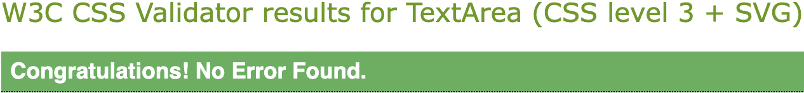
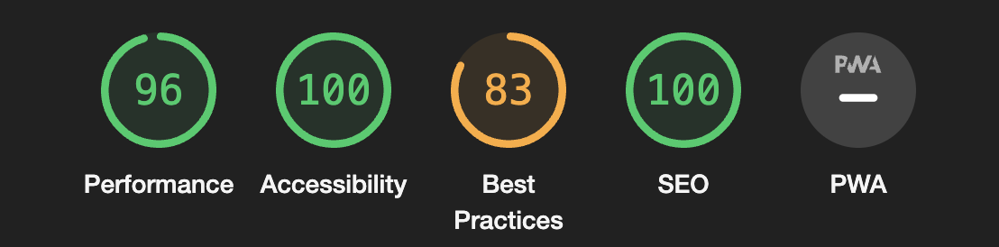

# Rock Paper Scissors
> [Click here to view the live website on GitHub Pages](https://matthewbrownlow.github.io/rock-paper-scissors/) Please note: To open any links in this document in a new browser tab, please press `Cmd ⌘ + Click` (Mac) or `CTRL + Click` (Windows/Linux)

- Rock-paper-scissors was originally a hand game played between two people. It is often used as a simple method of decision-making or for entertainment purposes. This website is a digital version of such, consisting of HTML elements, CSS styling and JavaScript functions to make it possible.

- This website is a game that can be enjoyed by people of all ages and backgrounds. It is not specifically targeted towards any particular group or demographic. It is purely for nostalgic purposes.

- According to the World Rock Paper Scissors Association `www.wrpsa.com`, versions of the game originated in China as far back as 1600 before spreading to Japan, where it was called “Jon Ken Pon”. The Japanese game eventually spread to Europe in the early 20th Century and made it to the United States by the 1930s.

- Rock-paper-scissors is a simple hand game played between two people. Each player simultaneously forms one of three hand gestures: rock (a closed fist), paper (an open hand), or scissors (the index and middle fingers extended). The outcome of the game is determined by a set of rules: rock beats scissors, scissors beats paper, and paper beats rock. The game can be played in a single round or as a series of rounds, with the winner of each round determined by the gestures chosen. It is a widely known and popular game enjoyed by people of all ages as a form of entertainment or a way to settle decisions in a playful manner.

## **Color Palette**

- These particular pastel colors (`#FAFAD2` Cream, `#FFB6C1` Cherry Blossom Pink, `#ASS8E6` Light Blue) have been used as they complement each other well and have soft tones making it easier on the eyes when viewing.

## **Features**

- My project is a rock-paper-scissors game website that aims to provide an enjoyable and interactive gaming experience for users of all ages and backgrounds.

    - `User Interface:` The website features a user-friendly interface with clear instructions and intuitive design, ensuring that players can easily navigate and understand the game mechanics.

    - `Game Logic:` The core of the project lies in the implementation of the rock-paper-scissors game logic, allowing users to play against the computer and experience the thrill of making choices and competing for victories.

    - `Randomised Computer Selection:` The computer opponent's choice is randomised, providing an element of surprise and ensuring that the game remains unpredictable and challenging for the user.

    - `Score Tracking:` The project keeps track of the player's score as they progress through the game, allowing them to see their performance and strive for improvement.

    - `Real-time Result Updates:` The game provides immediate feedback on each round's outcome, displaying whether the player wins, loses, or ties, providing a sense of engagement and excitement.

    - `Responsive Design:` The website is designed to be responsive and accessible across various devices, allowing users to enjoy the game on desktop computers, laptops, tablets, and smartphones.

    - `Casual Entertainment:` The project offers a casual and entertaining experience, providing a way for users to relax, have fun, and pass the time, whether they are playing alone or with friends.

    - `Universal Appeal:` The rock-paper-scissors game has broad appeal, catering to a wide range of users who are looking for a simple and engaging game that requires minimal setup and can be played quickly.

- By providing an intuitive interface, enjoyable gameplay, and convenient accessibility, my project aims to cater to users seeking a fun and interactive rock-paper-scissors gaming experience, regardless of their age or background.

## **Existing Features**

#### **Title/ Logo**

- The heading text/ icon logo is simplistic is design and scripts exactly what this website represents. The `Font Awesome` icons represent the different choices in the game: `rock` (a closed fist), `paper` (an open hand), or `scissors` (the index and middle fingers extended).

#### **Choices**

- This section displays the game buttons with their corresponding choices and once again, `Font Awesome` icons (keeping with the theme).

#### **How to Play**

- This section exhibits the `How-to-Play` steps for players who needs a visial dialog on how to play.

#### **Rules**

- This section displays the `Game Rules` for players who need a visial dialog on the corresponding game rules.

#### **Results**

- This section appears once the player has pressed one of the buttons for the first time, displying the `Game Results` in real time.

### **computerPlay( ) Function**

- The `computerPlay()` function randomly selects and returns either `rock`, `paper`, or `scissors`. It represents the computer's choice in a game.

### **playRound( ) Function**

- The `playRound()` function determines the winner of a round in rock-paper-scissors based on the `playerSelection` and `computerSelection` inputs. It returns a string indicating the outcome: either `"You win!"` with the winning choice, `"It's a tie!"` if both choices are the same, or `"You lose!"` with the winning choice for the computer.

### **updateResult( ) Function**

- The `updateResult()` function updates the round result and game result in the HTML document. It takes two parameters: `roundResult` and `gameResult`. It retrieves the corresponding HTML elements using their ids, and sets their `textContent` property to the respective parameter values.

### **game( ) Function**

- The `game()` function sets up and manages the rock-paper-scissors game. It initializes the player and computer scores to 0 and attaches click event listeners to elements with the `"choice"` class. When a choice is clicked, it determines the round result, updates the scores, and calls the `updateResult()` function to display the results. If a player reaches a score of 5, it determines the game result, displays an alert, updates the displayed result, and resets the scores to 0.

## **Validator Testing**

**HTML Markup**

- No errors were returned when passing through the official [W3C HTML Markup Validator](https://validator.w3.org/#validate_by_input)

**CSS Styling**

- No errors were found when passing through the official [(Jigsaw) CSS Validator](https://jigsaw.w3.org/css-validator/)

**JavaScript**

- No errors were found when passing through the official [Jshint validator](https://jshint.com/)
    - The following metrics were returned: 
    - There are 6 functions in this file.
    - Function with the largest signature take 2 arguments, while the median is 0.5.
    - Largest function has 15 statements in it, while the median is 4.
    - The most complex function has a cyclomatic complexity value of 8 while the median is 1.

**Chrome Lighthouse**

- Lighthouse is an open-source, automated auditing tool for improving the quality of web pages.

## **Deployment**

- The site was deployed to `GitHub` pages. The steps to deploy are as follows:
    - In the GitHub repository, navigate to the `Settings` tab
    - On the left-hand-side, under the `Code and automation` options, select `Pages`
    - From the `Branch` drop-down menu, select `main`.
    - Once the `main` branch has been selected, the page will be automatically refreshed with a detailed ribbon display to indicate the successful deployment; enclosing a live `URL` to the project website hosted by GitHub.

> [Click here to view the live website on GitHub Pages](https://matthewbrownlow.github.io/rock-paper-scissors/) Please note: To open any links in this document in a new browser tab, please press `Cmd ⌘ + Click` (Mac) or `CTRL + Click` (Windows/Linux)

## **Credits**

- [Code Institute](https://codeinstitute.net/)
- [Stack Overflow](https://stackoverflow.com/)
- [Font Awesome](https://fontawesome.com/)
- [YouTube](https://www.youtube.com/)
- [W3School](https://www.w3schools.com/)