# Rock Paper Scissors
> [Click here to view the live website on GitHub Pages](https://matthewbrownlow.github.io/rock-paper-scissors/) Please note: To open any links in this document in a new browser tab, please press `Cmd ⌘ + Click` (Mac) or `CTRL + Click` (Windows/Linux)

Introduction Text Here...

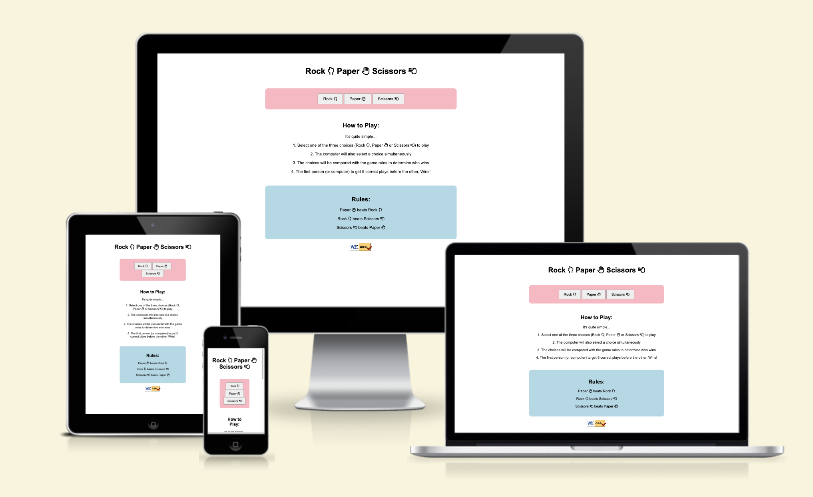

## **Color Palette**

Color Palette Text Here...

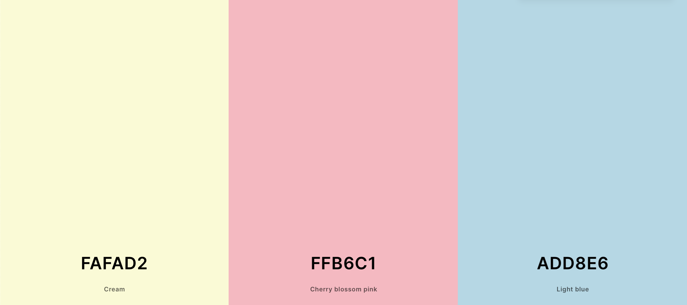

## **Features**

Text Here...

### **Existing Features**

Text Here...

#### **Title/ Logo**

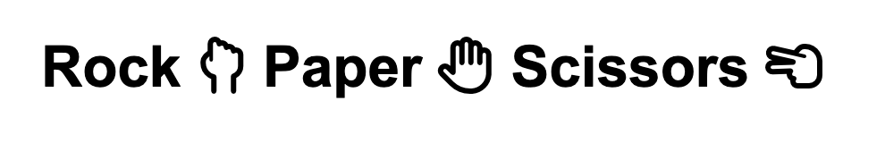

Text Here...

#### **Choices**

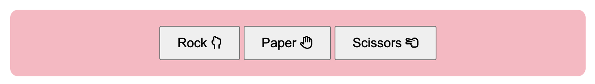

Text Here...

#### **How to Play**

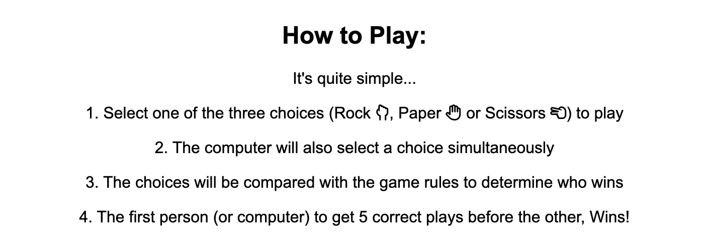

Text Here...

#### **Rules**

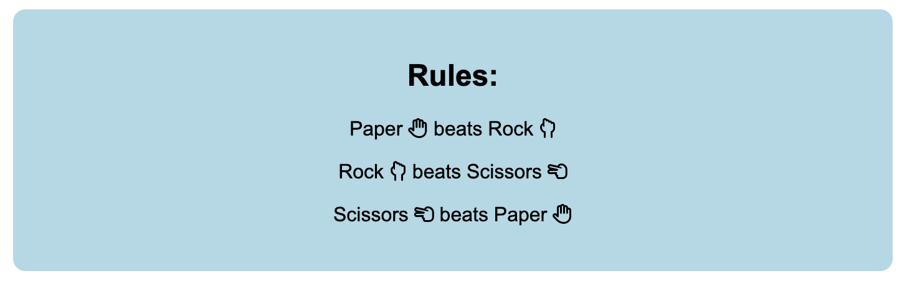

Text Here...

#### **Results**

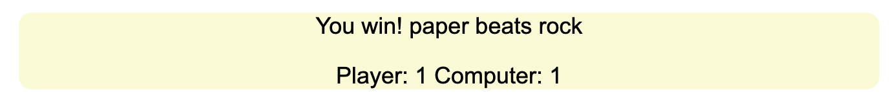

Text Here...

### **computerPlay Function**

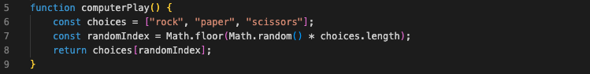

The computerPlay() function randomly selects and returns either "rock", "paper", or "scissors". It represents the computer's choice in a game.

### **playRound Function**

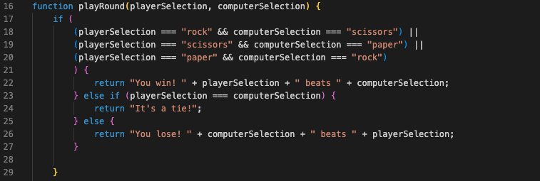

The playRound() function determines the winner of a round in rock-paper-scissors based on the playerSelection and computerSelection inputs. It returns a string indicating the outcome: either "You win!" with the winning choice, "It's a tie!" if both choices are the same, or "You lose!" with the winning choice for the computer.

### **updateResult Function**

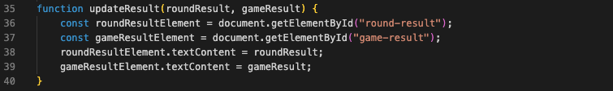

The updateResult() function updates the round result and game result in the HTML document. It takes two parameters: roundResult and gameResult. It retrieves the corresponding HTML elements using their IDs, and sets their textContent property to the respective parameter values.

### **game Function**

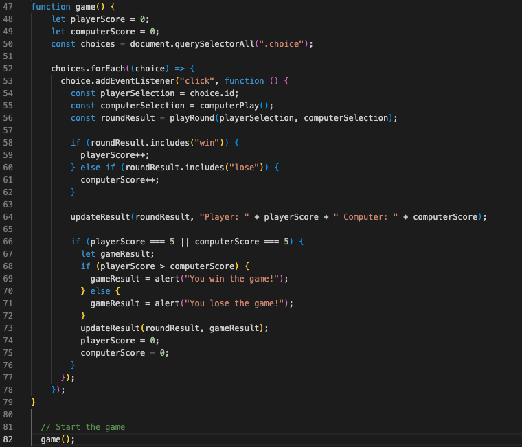

The game() function sets up and manages the rock-paper-scissors game. It initializes the player and computer scores to 0 and attaches click event listeners to elements with the "choice" class. When a choice is clicked, it determines the round result, updates the scores, and calls the updateResult() function to display the results. If a player reaches a score of 5, it determines the game result, displays an alert, updates the displayed result, and resets the scores to 0.